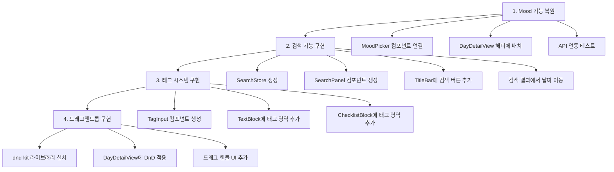

# Wition 기능 개선 기획안

## 📋 개요

**목표:** 버그 수정 및 미완성 기능 완성  
**범위:** Mood 기능 복원, 검색 UI 구현, 태그 시스템 추가, 드래그앤드롭 순서 변경  
**대상 앱:** Wition (Electron + React + TypeScript 캘린더 블록 노트)

---

## 🔍 현재 상태 분석

### 기술 스택
- **Frontend:** React 18, TypeScript, Tailwind CSS
- **State:** Zustand
- **Backend:** Electron 33, better-sqlite3
- **Build:** electron-vite, electron-builder

### 기존 구현 상태

| 기능 | DB | API | UI | 상태 |
|------|:--:|:---:|:--:|------|
| Mood | ✅ | ✅ | ❌ | API 있으나 UI 제거됨 |
| 검색 | ✅ | ✅ | ❌ | API만 존재 |
| 태그 | ✅ | ⚠️ | ❌ | DB 필드만 존재 |
| 순서변경 | ✅ | ✅ | ❌ | API만 존재 |

---

## 📝 상세 기획

### 1. Mood 기능 복원

#### 1.1 현재 상태
- [`DayDetailView.tsx:74`](../src/components/DayDetail/DayDetailView.tsx:74) - MoodPicker 제거됨 주석
- [`MoodPicker.tsx`](../src/components/common/MoodPicker.tsx) - 컴포넌트는 존재
- [`updateMood`](../src-main/db/queries.ts:107) API 구현됨
- [`CalendarCell`](../src/components/Calendar/CalendarCell.tsx:39)에서 mood 표시 코드 있음

#### 1.2 작업 내용

```
src/components/DayDetail/DayDetailView.tsx
├── MoodPicker import 추가
├── handleMoodChange 함수 구현
└── 헤더 영역에 MoodPicker 렌더링
```

#### 1.3 UI 배치
```
┌─────────────────────────────────────────┐
│ ← 2026년 3월 4일 (화)     [😊😐😔🔥💡🎉😴💪] │  ← 헤더 우측에 배치
├─────────────────────────────────────────┤
│                                         │
│  블록 목록...                            │
│                                         │
└─────────────────────────────────────────┘
```

---

### 2. 검색 기능 구현

#### 2.1 현재 상태
- [`search API`](../src/types/index.ts:53) 구현됨
- [`searchItems`](../src-main/db/queries.ts:50) 쿼리 구현됨 (content, tags 검색)

#### 2.2 작업 내용

**신규 컴포넌트 생성:**
```
src/components/Search/
├── SearchPanel.tsx      # 검색 슬라이드 패널
├── SearchInput.tsx      # 검색 입력
└── SearchResults.tsx    # 검색 결과 목록
```

**신규 Store 생성:**
```
src/stores/searchStore.ts
├── query: string
├── results: NoteItem[]
├── loading: boolean
├── search(query)
└── clear()
```

#### 2.3 UI 배치
```
┌─────────────────────────────────────────┐
│ Wition              [🔍] ─ □ ✕          │  ← 타이틀바에 검색 아이콘
├─────────────────────────────────────────┤
│ [검색 패널 슬라이드 인]                   │
│ ┌─────────────────────────┐             │
│ │ 🔍 검색어 입력...        │             │
│ ├─────────────────────────┤             │
│ │ 📄 2026-03-04           │             │
│ │    검색 결과 미리보기...  │             │
│ │ 📄 2026-03-02           │             │
│ │    검색 결과 미리보기...  │             │
│ └─────────────────────────┘             │
└─────────────────────────────────────────┘
```

#### 2.4 검색 결과 클릭 동작
- 해당 날짜로 이동
- DayDetailView 열기
- 매칭된 블록 하이라이트 (선택사항)

---

### 3. 태그 시스템 구현

#### 3.1 현재 상태
- [`note_item.tags`](../src-main/db/schema.ts:19) 필드 존재 (JSON 배열)
- 입력/표시 UI 없음

#### 3.2 작업 내용

**컴포넌트 수정:**
```
src/components/DayDetail/
├── TextBlock.tsx
│   ├── 태그 표시 영역 추가
│   └── 태그 편집 모드 추가
├── ChecklistBlock.tsx
│   ├── 태그 표시 영역 추가
│   └── 태그 편집 모드 추가
└── TagInput.tsx (신규)
    ├── 태그 입력 필드
    ├── 태그 칩 표시
    └── 태그 제거 버튼
```

**Store 수정:**
```
src/stores/dayStore.ts
└── update() 함수로 tags 업데이트 가능 (이미 구현됨)
```

#### 3.3 UI 배치
```
┌─────────────────────────────────────────┐
│  메모 내용 텍스트...                      │
│                                         │
│  ┌──────┐ ┌──────┐ ┌────────┐          │
│  │ #일  │ │ #중요│ │ + 태그추가 │          │
│  └──────┘ └──────┘ └────────┘          │
│                          📌 🗑           │
└─────────────────────────────────────────┘
```

#### 3.4 태그 입력 방식
- `#` 입력 시 자동 태그 모드
- Enter 또는 스페이스로 태그 확정
- 기존 태그 자동완성 (선택사항)

---

### 4. 드래그앤드롭 순서 변경

#### 4.1 현재 상태
- [`reorderNoteItems`](../src-main/db/queries.ts:94) 쿼리 구현됨
- [`reorder`](../src/stores/dayStore.ts:25) 액션 구현됨
- UI 없음

#### 4.2 작업 내용

**라이브러리 선택:**
- `@dnd-kit/core` + `@dnd-kit/sortable` (권장)
- 또는 순수 HTML5 Drag and Drop API

**컴포넌트 수정:**
```
src/components/DayDetail/
└── DayDetailView.tsx
    ├── DndContext 래핑
    ├── SortableContext 적용
    └── 드래그 핸들 추가
```

#### 4.3 UI 배치
```
┌─────────────────────────────────────────┐
│  ⋮⋮ 메모 블록 1                          │  ← 좌측에 드래그 핸들
│  ⋮⋮ 체크리스트 블록                       │
│  ⋮⋮ 메모 블록 2                          │
└─────────────────────────────────────────┘
```

#### 4.4 드래그 동작
- 드래그 시작: 핸들 클릭 후 이동
- 드래그 중: 플레이스홀더 표시
- 드롭: 순서 확정, DB 업데이트

---

## 🏗️ 구현 순서



---

## 📁 파일 변경 예상

### 신규 생성
| 파일 | 설명 |
|------|------|
| `src/stores/searchStore.ts` | 검색 상태 관리 |
| `src/components/Search/SearchPanel.tsx` | 검색 패널 |
| `src/components/Search/SearchInput.tsx` | 검색 입력 |
| `src/components/Search/SearchResults.tsx` | 검색 결과 |
| `src/components/DayDetail/TagInput.tsx` | 태그 입력 컴포넌트 |

### 수정 예정
| 파일 | 변경 내용 |
|------|----------|
| `src/components/DayDetail/DayDetailView.tsx` | MoodPicker 추가, DnD 래핑 |
| `src/components/DayDetail/TextBlock.tsx` | 태그 표시/편집, 드래그 핸들 |
| `src/components/DayDetail/ChecklistBlock.tsx` | 태그 표시/편집, 드래그 핸들 |
| `src/components/common/TitleBar.tsx` | 검색 버튼 추가 |
| `src/App.tsx` | SearchPanel 추가 |
| `package.json` | dnd-kit 의존성 추가 |

---

## ✅ 완료 기준

### Mood 기능
- [ ] DayDetailView 헤더에 MoodPicker 표시
- [ ] 감정 선택 시 DB 저장
- [ ] CalendarCell에 감정 이모지 표시
- [ ] 감정 해제 기능

### 검색 기능
- [ ] TitleBar 검색 버튼 클릭 시 패널 열림
- [ ] 실시간 검색 결과 표시
- [ ] 검색 결과 클릭 시 해당 날짜로 이동
- [ ] ESC 키로 검색 패널 닫기

### 태그 시스템
- [ ] 블록 하단에 태그 칩 표시
- [ ] 태그 추가/제거 기능
- [ ] 태그로 검색 가능

### 드래그앤드롭
- [ ] 드래그 핸들 표시
- [ ] 블록 순서 변경
- [ ] 변경된 순서 DB 저장

---

## 🎨 디자인 가이드

### 색상 (기존 사용 중)
- Accent: `accent-500` (메인 액션)
- Gray scale: Tailwind 기본
- Dark mode 지원

### 컴포넌트 스타일
- 둥근 모서리: `rounded-lg`, `rounded-md`
- 간격: `gap-1`, `gap-2`, `px-3`, `py-2`
- 호버 효과: `hover:bg-gray-100 dark:hover:bg-gray-800`
- 애니메이션: `transition-colors`, `transition-all`

---

## 📌 참고 사항

### 기존 코드 패턴 준수
- Zustand store 패턴 유지
- window.api IPC 통신 방식 유지
- memo를 활용한 렌더링 최적화
- 다크모드 대응 (dark: prefix)

### 주의사항
- MoodPicker는 이미 구현되어 있어 import만 필요
- 검색 API는 대소문자 구분 없이 LIKE 검색
- 태그는 JSON 배열로 저장 (기존 방식 유지)
- 드래그앤드롭은 터치 디바이스 고려 필요
